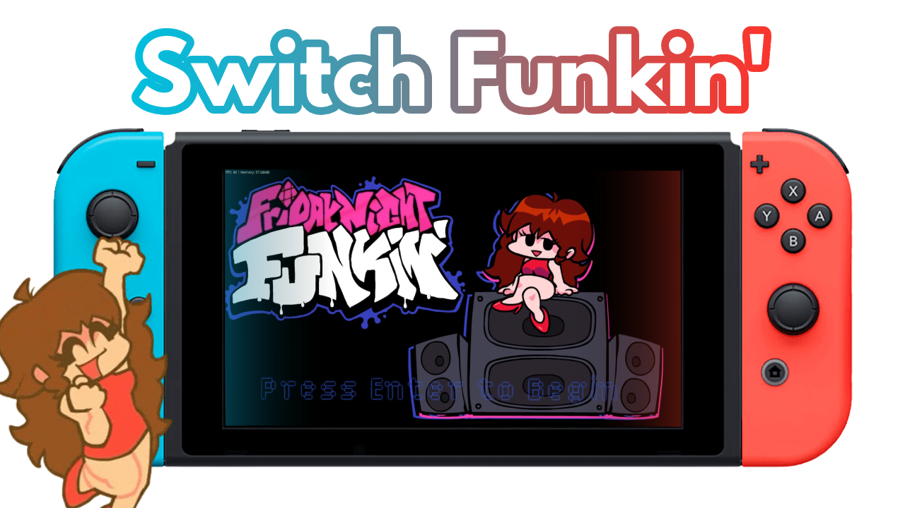
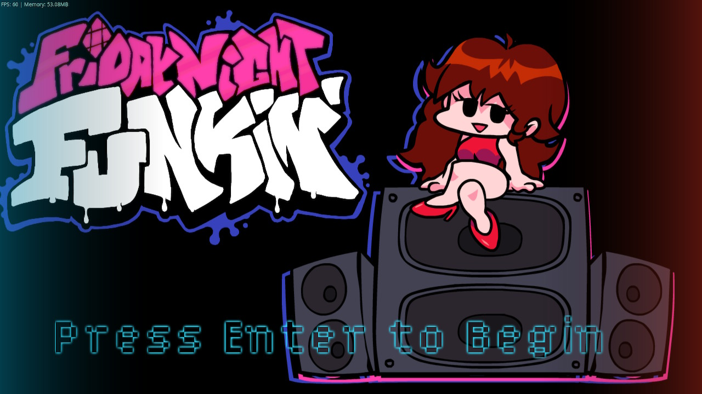
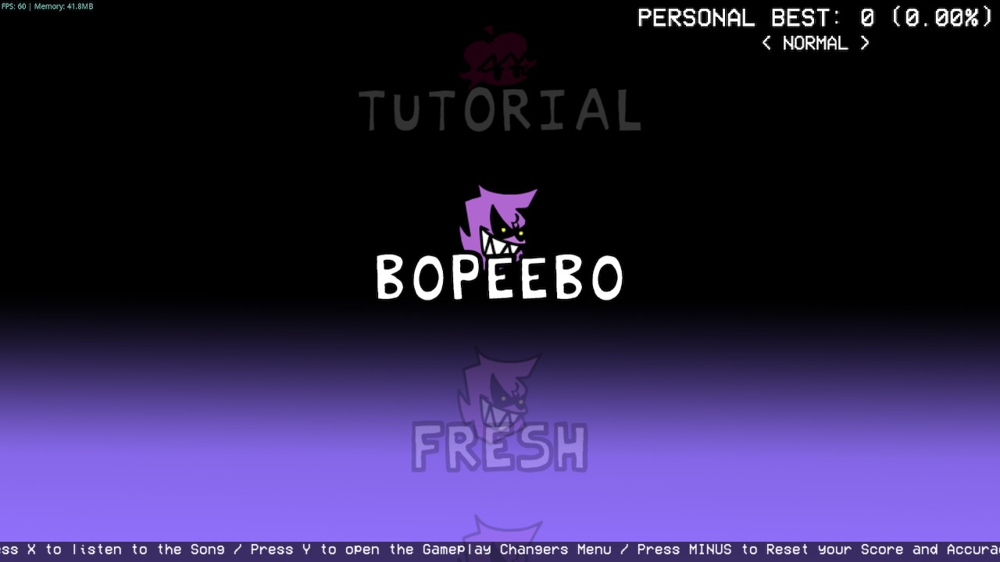

<h1 align="center">
  
</h1>

<h3 align="center">Real FNF' for Nintendo Switch, just, why not?</h3>

So yeah… this is [Psych Engine 1.0.4](https://github.com/ShadowMario/FNF-PsychEngine) for Nintendo Switch. It’s not a recreation or an inspiration — this is the real [HaxeFlixel](https://haxeflixel.com/) running on Switch! So yes, we have Friday Night Funkin' on Nintendo Switch!

This is possible thanks to [Lime-NX](https://github.com/Slushi-Github/lime-nx), which allows compiling Lime projects for the console using DevKitPro and DevKitA64, meaning homebrew stuff.

That’s it, there’s not much more to say. Enjoy the real Friday Night Funkin' experience on Nintendo Switch now!

## Considerations

Everything in Psych Engine works, with the important exception of videos, because there is currently no way to get [hxvlc](https://github.com/MAJigsaw77/hxvlc) working on the Switch target. Aside from that, HScript and Lua, shaders, and even mod folder support are functional on this platform.

The engine **CANNOT** cache assets, so loading screens can be slow, and even loading the game over screen a second time can be slow. This seems to be a limitation of how the game is compiled for this platform. It might have a solution by not depending on OpenFL for that, but it’s not something I want to modify at the moment.

If you think you can play with a keyboard or mouse — no. Unfortunately, it seems this is something that HorizonOS (the Nintendo Switch operating system) prevents, or at least does not allow by default.

Also keep something in mind: The Nintendo Switch is hardware from around 2016, and Psych Engine is apparently not the best FNF engine for this console. This may require optimizing the engine or the mod, but in the end we are dealing with a mid-2016 device with 4 GB of RAM — you can’t expect miracles on this platform, okay? From what I saw, [V-Slice](https://github.com/FunkinCrew/Funkin) should perform better, but it has dependencies that make it impossible to compile for Nintendo Switch. This is the reason I chose Psych Engine, besides it being the FNF engine I know the most and that I like.

Even though it may sound obvious, mods that use special mechanics requiring extra keys will need modifications to support controllers.

Don't expect this engine to compile to other platforms. Although I have tried to maintain compilation with at least Linux, this engine is modified to work well with the Nintendo Switch.

## Installation

Download the latest version:
- From [GitHub](https://github.com/https://github.com/Slushi-Github/Switch-Funkin/releases/latest).
- From [GitHub Actions](https://github.com/Slushi-Github/Switch-Funkin/actions).

Inside the downloaded ZIP, you will find a file that ends with `.nro`. Drag it into the `switch` folder on your console’s SD card. Then simply open the Homebrew Menu from an official game (usually by holding the **R** button while launching a game from the HOME menu), look for **"FNF: Switch Funkin'"**, open it, and enjoy!

For now, I do not offer an NSP file to install it directly on the console and skip the Homebrew Menu step. I am also considering uploading it to the [Homebrew App Store for Nintendo Switch](https://hb-app.store/switch) to make installation and updates even easier.

## Mods and others

Installing mods in Switch Funkin' is easy. Once you open the game at least once, on your SD card, inside the `switch` folder, you will see a new folder called `Switch-Funkin`. Inside it, you will find the `mods` folder, which works exactly like normal Psych Engine. You will also find folders with crash logs or shader error logs, as well as the `saves` folder, which stores the game’s save data — the same standard [HaxeFlixel save files](https://haxeflixel.com/documentation/flxsave/).

## Compiling the engine

First, follow the [Psych Engine](https://github.com/ShadowMario/FNF-PsychEngine) setup steps regarding dependencies for your operating system.

Then you need to follow the steps to compile with [Lime-NX](https://github.com/Slushi-Github/lime-nx?tab=readme-ov-file#how-to-use) for Nintendo Switch.

You also need the following library:

```bash
haxelib git hx_libnx https://github.com/Slushi-Github/hx_libnx
```

And the DevKitPro Lua 5.1 library if you want to use Lua in this engine (otherwise, remove `LUA_ALLOWED` from the `Project.xml` file):

(If you are on Linux/macOS, you will most likely need to use `sudo dkp-pacman` instead of `pacman`)

```bash
pacman -S switch-liblua51
```

Change the `<config:switch ip="192.168.1.140"/>` in the `Project.xml` file to the IP of your Switch.

And that’s it! If you did everything correctly, you should be able to compile the engine with `lime test switch` or `lime build switch` and you’re done!

## Contributing

If you want to contribute to this project, you can do it by creating a pull request on this repository, test that your changes work __**on the real hardware**__, I would recommend attaching images if it is a change that can be shown.

## Credits

* [Psych Engine](https://github.com/ShadowMario/FNF-PsychEngine): The base for Switch Funkin'.

* [P-Slice](https://github.com/Psych-Slice/P-Slice): Where I took the code used to implement the hitbox for playing with the Nintendo Switch touchscreen.

* Roxy (On Discord): It helped me discover performance issues in the Weekend songs (it turned out that the **original** rain shader and Nene's speaker visualizer were too much for the Switch's CPU and GPU).

## Other information

This engine uses code from [Vupx Engine (My framework engine for the Nintendo Switch)](https://slushi-github.github.io/Vupx-Engine) and also from [Slushi Engine](https://github.com/Slushi-Github/Slushi-Engine) (only the Slushi Freeplay).

... [This](https://www.youtube.com/watch?v=8RBJdMUOzrE) is no longer a meme XDD.

## Screenshots



